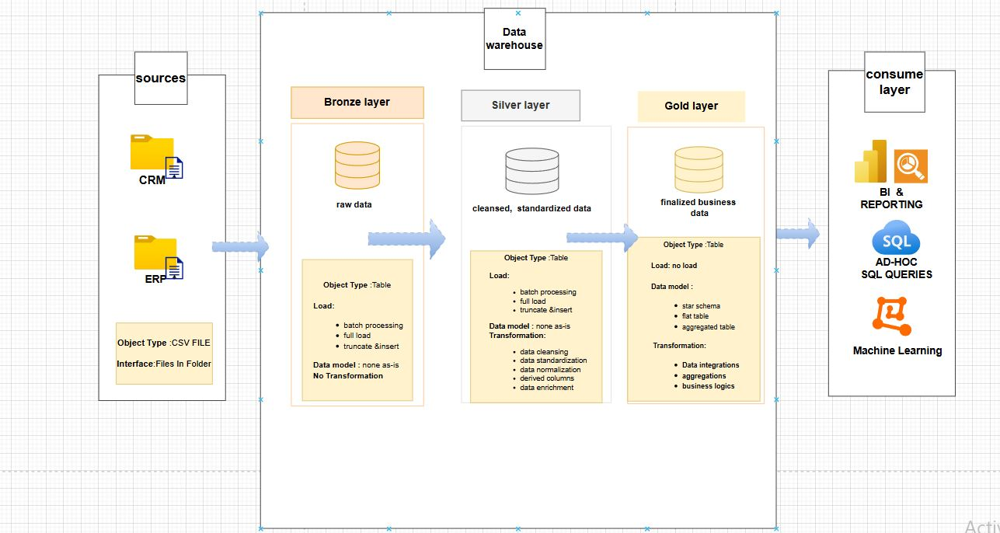
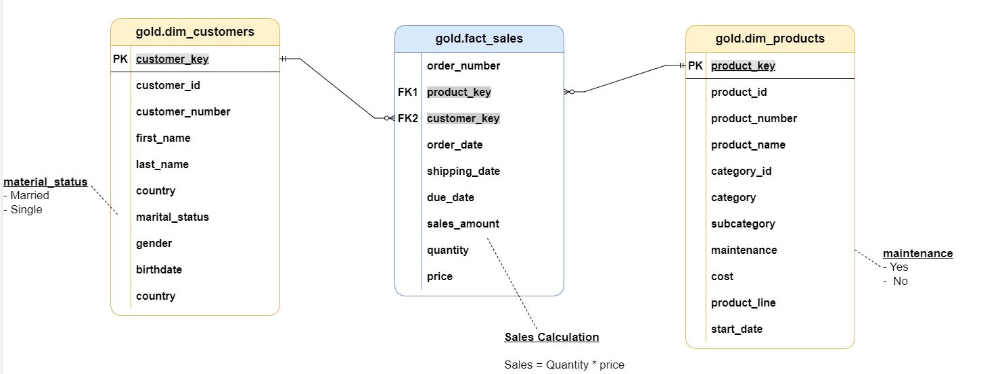
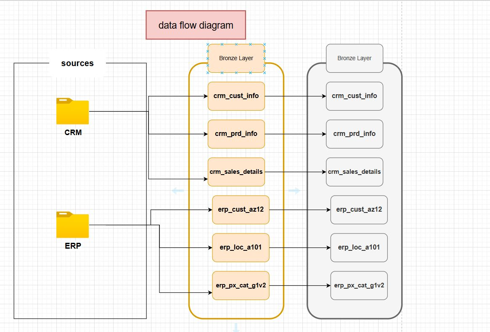
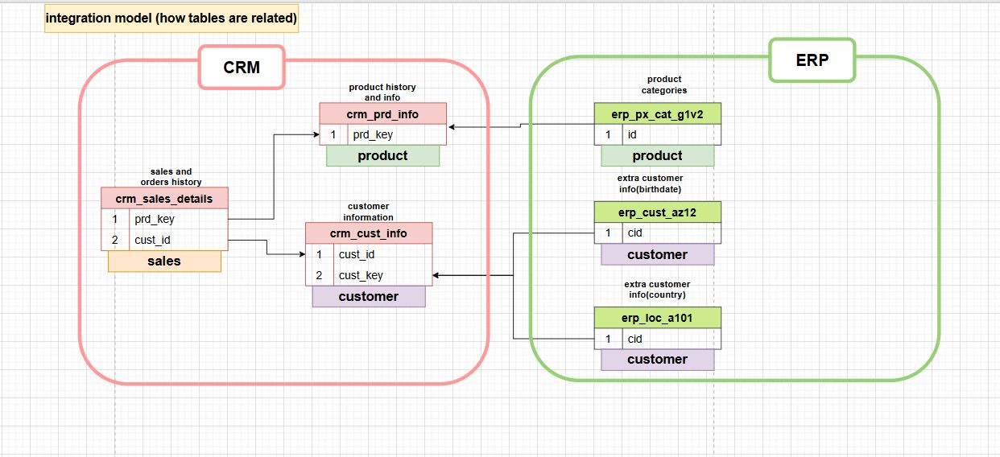

# data-warehouse-sql-project
SQL-based data warehouse project including ETL processes, data modeling, and analytical queries for business insights.
# 🏗️ Data Warehouse SQL Project

## 📊 Overview
This project demonstrates the design and implementation of a SQL-based data warehouse, including ETL processes, data modeling, and analytical queries to generate business insights.

---

## 🛠️ Tools & Technologies
- SQL Server
- ETL Processes
- Data Modeling
- Analytical Queries

---

## 🧱 Project Components

### 📌 Data Modeling
- Designed star schema and relationships between tables  
- Created structured data models for efficient querying  

### 🔄 ETL Process
- Extracted, transformed, and loaded data into the warehouse  
- Cleaned and structured raw data for analysis  

### 📈 Analytics
- Wrote SQL queries using:
  - SELECT
  - JOIN
  - GROUP BY
- Generated insights from structured datasets  

---

## 📷 Diagrams & Screenshots

### Architecture

### Data Model

### DFD

### Integration Mode

---

## 📁 Project Structure

---

## 🎯 Key Learnings
- Understanding data warehouse architecture  
- Writing efficient SQL queries  
- Designing scalable data models  
- Applying ETL concepts in real projects

